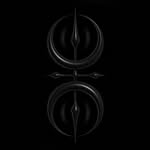

# Logo Circolare con Effetto LED - @sken.blk

## 🎨 Modifiche Implementate

### **Design Circolare Elegante**
- **Logo circolare:** Trasformato da rettangolare a perfettamente rotondo
- **Dimensioni maggiori:** Aumentato da 40px a 60px (desktop)
- **Effetto LED bianco:** Contorno luminoso sfumato e discreto

### ✨ **Effetti Visivi**

#### **Glow Effect Multi-Layer**
```css
box-shadow: 
  0 0 10px rgba(255,255,255,0.3),   /* Inner glow */
  0 0 20px rgba(255,255,255,0.15),  /* Medium glow */
  0 0 30px rgba(255,255,255,0.1),   /* Outer glow */
  inset 0 0 5px rgba(255,255,255,0.1); /* Inner highlight */
```

#### **Animazione Sottile LED**
- **Rotating gradient:** Effetto cono di luce che ruota lentamente (4s)
- **Hover enhancement:** Glow più intenso al passaggio del mouse
- **Scale effect:** Leggero ingrandimento (1.05x) on hover

### 🔧 **Implementazione Tecnica**

#### **HTML (index.html)**
```html
<a href="#home" class="nav__logo" aria-label="Torna alla home">
    
</a>
```

#### **CSS (main.css)**
1. **Contenitore circolare** con background gradient
2. **Pseudo-elemento ::before** per l'animazione conica
3. **Immagine circolare** con object-fit: cover
4. **Transizioni fluide** per tutti gli effetti

### 📱 **Design Responsivo**

#### **Desktop (>768px)**
- Dimensione: 60x60px
- Glow completo e animazione a 4s

#### **Tablet (≤768px)**  
- Dimensione: 50x50px
- Glow ridotto per performance

#### **Mobile (≤480px)**
- Dimensione: 45x45px  
- Animazione più lenta (6s) per ridurre il consumo

### 🎯 **Caratteristiche Chiave**

1. **Effetto LED Discreto:** Bianco sfumato, non troppo accentuato
2. **Performance Ottimizzata:** GPU-accelerated animations
3. **Accessibilità:** Mantiene aria-label e contrasti appropriati
4. **Hover Feedback:** Interazione visiva al passaggio del mouse
5. **Mobile-Friendly:** Responsive e ottimizzato per touch

### 💡 **Dettagli Stilistici**

- **Colori:** Bianco con opacità variabili (0.1 - 0.4)
- **Border-radius:** 50% per forma perfettamente circolare
- **Z-index:** Stratificazione corretta degli elementi
- **Overflow:** Hidden per contenere gli effetti
- **Background:** Gradient lineare per depth

### ⚡ **Performance**

- **Transform3d:** Hardware acceleration
- **Will-change:** Ottimizzazione rendering
- **Reduced motion:** Rispetta le preferenze utente
- **Efficient animations:** CSS-only, no JavaScript

Il nuovo logo mantiene l'eleganza dark del sito aggiungendo un tocco di modernità con l'effetto LED bianco discreto, perfettamente integrato con l'estetica @sken.blk.